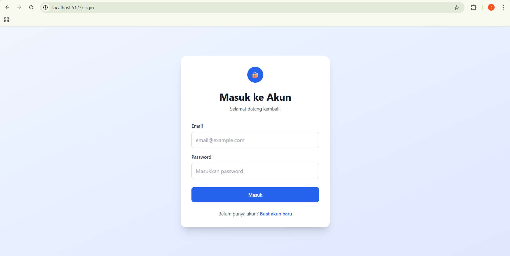
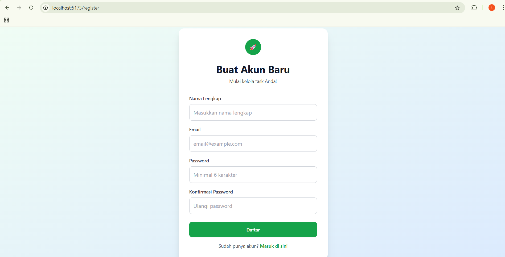
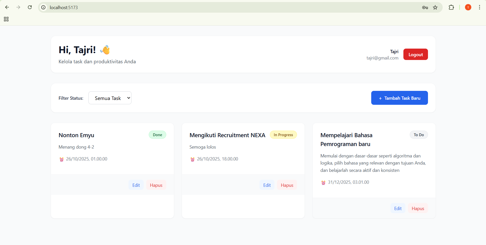
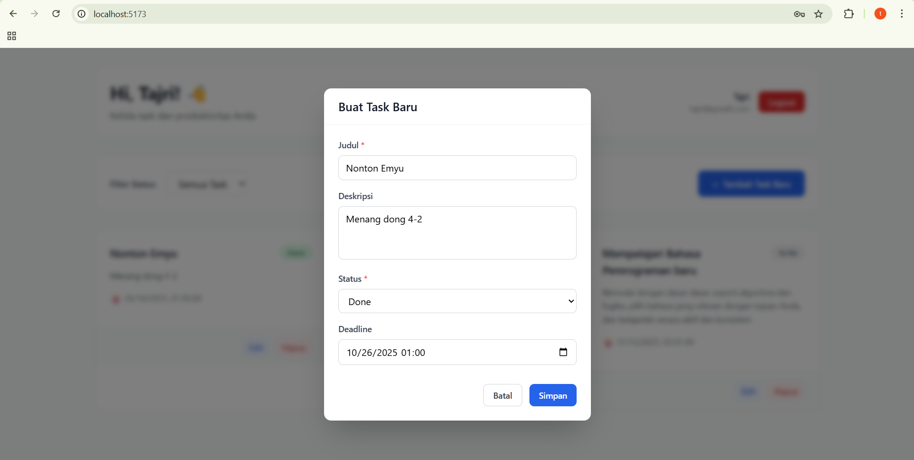
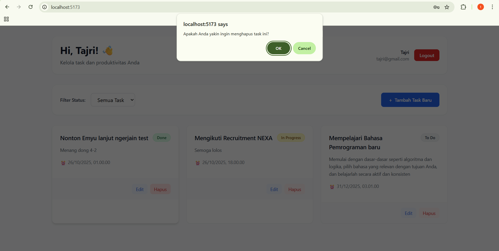

# Task Management System (Studi Kasus)

Ini adalah proyek studi kasus untuk membangun aplikasi Task Management System full-stack menggunakan Laravel untuk backend dan ReactJS untuk frontend.

Aplikasi ini memungkinkan pengguna untuk mendaftar, login, dan mengelola tugas harian mereka (CRUD) dengan aman, di mana setiap pengguna hanya dapat melihat dan mengelola tugas milik mereka sendiri.

## Screenshot

| Halaman Login | Halaman Register | Dashboard |
| :---: | :---: | :---: |
|  |  |  |

| Modal CRUD 1 | Modal CRUD 2 | Modal CRUD 3 |
| :---: | :---: | :---: |
|  |  |  |

---

## Teknologi yang Digunakan

* **Backend:** Laravel (PHP)
* **Frontend:** ReactJS (Vite)
* **Database:** PostgreSQL
* **Styling:** TailwindCSS
* **Autentikasi:** JWT (JSON Web Token)
* **API Client:** Axios

---

## Struktur Database (PostgreSQL)

### Tabel `users`
| Kolom | Tipe | Keterangan |
| :--- | :--- | :--- |
| `id` | `bigint` | Primary Key |
| `name` | `string` | Nama User |
| `email` | `string` | Email (Unik) |
| `password`| `string` | Hashed (bcrypt) |
| `...` | `...` | |

### Tabel `tasks`
| Kolom | Tipe | Keterangan |
| :--- | :--- | :--- |
| `task_id` | `bigint` | Primary Key |
| `user_id` | `bigint` | Foreign Key ke `users.id` |
| `title` | `string` | Judul Task |
| `description` | `text` | Deskripsi (Opsional) |
| `status` | `enum` | 'To Do', 'In Progress', 'Done' |
| `deadline` | `timestamp` | Batas Waktu (Opsional) |
| `...` | `...` | |

---

## Informasi Login Dummy

Anda dapat mendaftar (register) akun baru atau menggunakan akun dummy berikut untuk testing:

* **Email:** `tajri@gmail.com`
* **Password:** `tajri123`